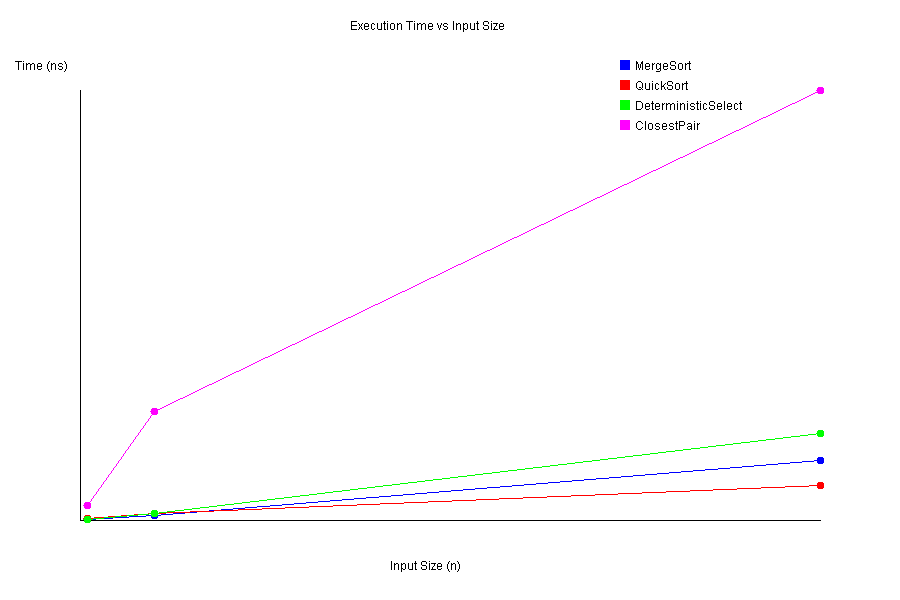
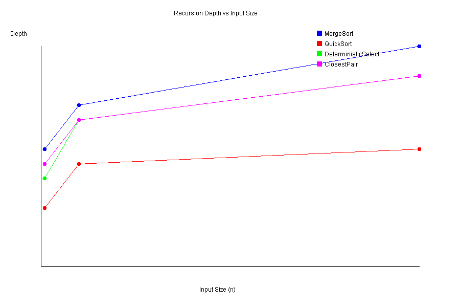
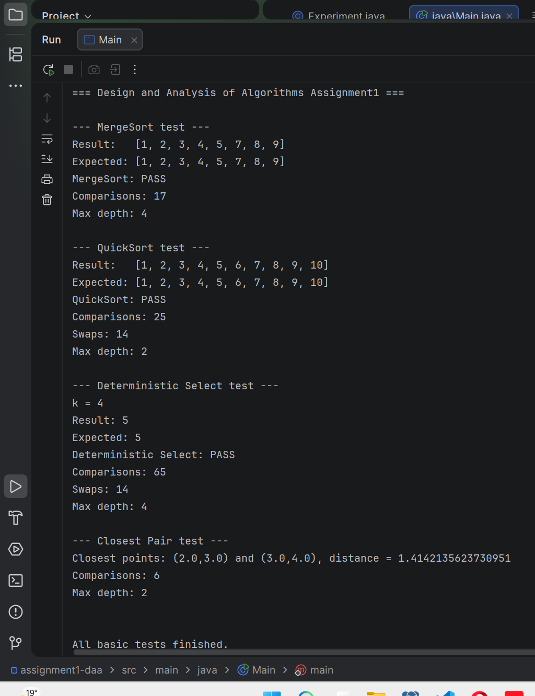
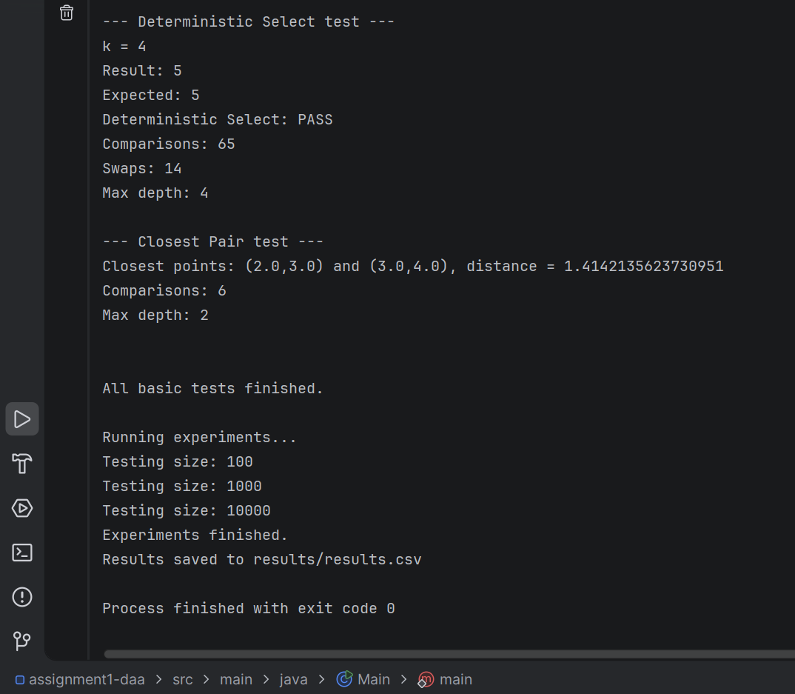
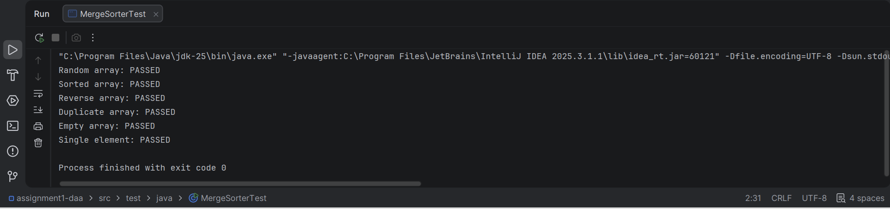
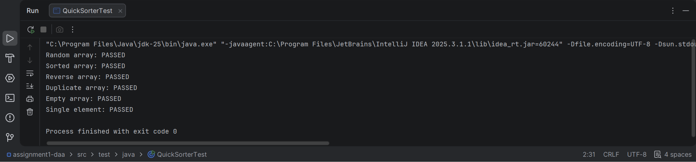
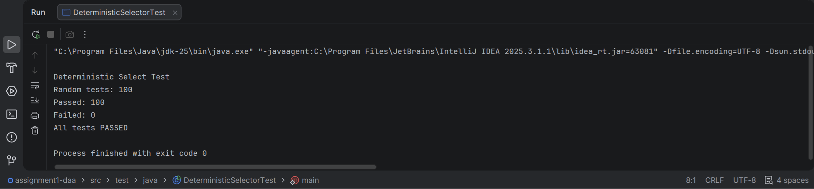
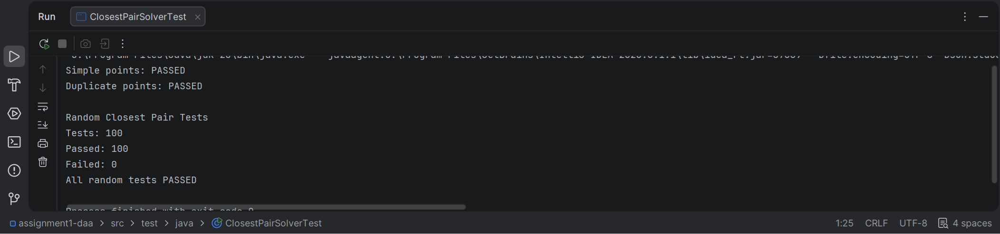
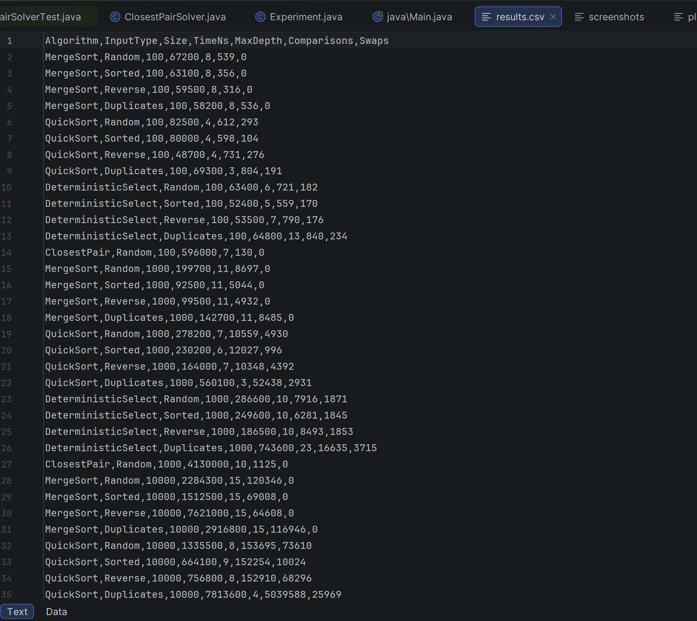

# Design and Analysis of Algorithms
## Assignment 1: Divide-and-Conquer Algorithm Analysis

# A. Project Overview

## Purpose of the Assignment

The purpose of this assignment is to implement and analyze divide-and-conquer algorithms in Java. The main goal is to understand how these algorithms work, analyze their theoretical complexity, and compare the theory with experimental results. The program also measures execution time, maximum recursion depth, comparisons, and swaps for different input sizes and input types.

## Implemented Algorithms

The following four algorithms were implemented:

1. Merge Sort
2. Randomized QuickSort
3. Deterministic Select (Median-of-Medians)
4. Closest Pair of Points

The experiments use input sizes of 100, 1000, and 10000. For array algorithms, different input types such as Random, Sorted, Reverse, and Duplicate-heavy were tested.

---

# B. Algorithm Analysis

## 1. Merge Sort

### How it works

Merge Sort divides an array into two smaller parts. Each part is sorted recursively, and then the two sorted parts are merged together. My implementation uses one reusable temporary array for merging. It also uses a cutoff of 16 elements. When a subarray has 16 elements or less, insertion sort is used instead of continuing the recursive division.

### Time and Space Complexity

- Best case: **O(n log n)**
- Average case: **O(n log n)**
- Worst case: **O(n log n)**
- Auxiliary space: **O(n)**
- Recursion stack: **O(log n)**

### Recurrence and Analysis

The recurrence for Merge Sort is:

`T(n) = 2T(n/2) + Θ(n)`

There are two recursive problems of size `n/2`, and merging requires linear time.
Using the Master Theorem:

- `a = 2`
- `b = 2`
- `f(n) = Θ(n)`
- `n^(log_b a) = n`

Therefore:

`T(n) = Θ(n log n)`

The insertion-sort cutoff changes the practical performance for small subarrays, but it does not change the overall asymptotic complexity.

---

## 2. Randomized QuickSort

### How it works

Randomized QuickSort chooses a random element as the pivot. The array is then partitioned so that smaller elements are placed on one side and larger elements on the other side. The partitioning is done in-place. After partitioning, my implementation recursively processes the smaller partition. The larger partition is processed using a loop. This is used to reduce recursion depth.

### Time and Space Complexity

- Expected time: **O(n log n)**
- Worst-case time: **O(n²)**
- Partition extra space: **O(1)**
- Recursion stack with smaller-first recursion: **O(log n)**

### Recurrence and Analysis

For approximately balanced partitions, the recurrence is:

`T(n) = 2T(n/2) + Θ(n)`

Using the Master Theorem, this gives:

`T(n) = Θ(n log n)`

For a very unbalanced partition, the recurrence can become:

`T(n) = T(n - 1) + Θ(n)`

which gives:

`T(n) = Θ(n²)`

Random pivot selection reduces the chance of repeatedly getting bad partitions, but it does not completely remove the theoretical worst case.

---

## 3. Deterministic Select

### How it works

Deterministic Select finds the k-th smallest element without sorting the whole array. The algorithm divides the elements into groups of five. Each group is sorted using insertion sort, and its median is found. The medians are collected, and the Median-of-Medians is selected as the pivot. The array is partitioned around this pivot. After partitioning, only the side containing the required k-th element is processed recursively.

### Time and Space Complexity

- Worst-case time: **O(n)**
- Partitioning is performed in-place.
- Recursive calls require additional stack space.

### Recurrence and Analysis

The main recurrence can be written as:

`T(n) <= T(n/5) + T(7n/10) + Θ(n)`

`T(n/5)` is used to find the median of the medians, while at most about `T(7n/10)` elements remain in the required partition. Using the Akra-Bazzi idea, the recursive parts shrink sufficiently and the linear work dominates the total growth.
Therefore:

`T(n) = Θ(n)`

This gives Deterministic Select a linear worst-case time complexity.

---

## 4. Closest Pair of Points

### How it works

The Closest Pair algorithm finds two points with the smallest Euclidean distance. The points are first sorted by their x-coordinate and y-coordinate. The set is divided into left and right parts, and the closest pair is found recursively in both parts. After this, the algorithm creates a strip around the middle line. Only points that can possibly produce a smaller distance are checked inside the strip. The y-order is maintained during recursion, so the strip does not need to be sorted again at every recursive level.

### Time and Space Complexity

- Time complexity: **O(n log n)**
- Initial sorting: **O(n log n)**
- Additional arrays and recursive processing require extra memory.

### Recurrence and Analysis

After the initial sorting, the divide-and-conquer part follows the recurrence:

`T(n) = 2T(n/2) + Θ(n)`

Using the Master Theorem:

`T(n) = Θ(n log n)`

This is better than the brute-force method, which checks every possible pair and requires **O(n²)** time.

---

# C. Experimental Results

The experiments were performed using `System.nanoTime()`.
Three input sizes were tested:

- 100
- 1000
- 10000

For Merge Sort, QuickSort, and Deterministic Select, four input types were used:

- Random
- Sorted
- Reverse
- Duplicates

Closest Pair was tested using randomly generated points.
The complete experimental data is stored in:

`results/results.csv`

## Execution-Time Results

| Algorithm | Input Type | n = 100 | n = 1000 | n = 10000 |
|---|---:|---:|---:|---:|
| MergeSort | Random | 67,800 ns | 671,900 ns | 2,279,000 ns |
| MergeSort | Sorted | 33,000 ns | 343,400 ns | 1,391,800 ns |
| MergeSort | Reverse | 72,000 ns | 374,400 ns | 1,926,200 ns |
| MergeSort | Duplicates | 46,100 ns | 102,600 ns | 2,277,800 ns |
| QuickSort | Random | 134,500 ns | 449,100 ns | 1,682,000 ns |
| QuickSort | Sorted | 98,800 ns | 244,800 ns | 786,900 ns |
| QuickSort | Reverse | 85,800 ns | 201,200 ns | 976,700 ns |
| QuickSort | Duplicates | 100,500 ns | 627,000 ns | 9,126,600 ns |
| Deterministic Select | Random | 87,100 ns | 754,100 ns | 4,601,900 ns |
| Deterministic Select | Sorted | 81,100 ns | 267,400 ns | 2,600,700 ns |
| Deterministic Select | Reverse | 106,900 ns | 230,700 ns | 3,491,300 ns |
| Deterministic Select | Duplicates | 99,200 ns | 831,300 ns | 43,988,600 ns |
| Closest Pair | Random | 1,182,900 ns | 7,160,300 ns | 39,175,900 ns |

## Recursion-Depth Results

| Algorithm | Input Type | n = 100 | n = 1000 | n = 10000 |
|---|---:|---:|---:|---:|
| MergeSort | Random | 4 | 7 | 11 |
| MergeSort | Sorted | 4 | 7 | 11 |
| MergeSort | Reverse | 4 | 7 | 11 |
| MergeSort | Duplicates | 4 | 7 | 11 |
| QuickSort | Random | 4 | 6 | 8 |
| QuickSort | Sorted | 4 | 7 | 8 |
| QuickSort | Reverse | 4 | 6 | 8 |
| QuickSort | Duplicates | 3 | 4 | 3 |
| Deterministic Select | Random | 5 | 10 | 13 |
| Deterministic Select | Sorted | 6 | 10 | 13 |
| Deterministic Select | Reverse | 7 | 10 | 13 |
| Deterministic Select | Duplicates | 9 | 83 | 221 |
| Closest Pair | Random | 7 | 10 | 13 |

The results show that input type can affect both execution time and recursion behavior. Duplicate-heavy inputs especially affected QuickSort and Deterministic Select in my implementation.

## Plot 1: Time vs. n

The following plot shows how execution time changes when the input size increases.

## Plot 2: Recursion Depth vs. n

The following plot shows the maximum recursion depth for increasing input sizes.

---

# D. Discussion

## 1. Do the results match theoretical complexity?

In general, the results follow the expected theoretical growth, but the measured execution times are not perfectly proportional to Big-O complexity. Merge Sort showed stable behavior as the input size increased. QuickSort also performed well for random, sorted, and reverse inputs. Deterministic Select showed relatively good growth for normal inputs, while Closest Pair handled 10000 points without using the O(n²) brute-force approach. The exact execution times can change between runs, so the experiment is better for observing general growth trends than proving complexity directly.

## 2. How does input structure affect performance?

The experiments show that input structure can have a noticeable effect. Merge Sort was relatively stable across different input types because its basic divide-and-merge process does not depend strongly on the original order. Randomized QuickSort worked well with random, sorted, and reverse inputs. However, duplicate-heavy input had a much larger effect. 
At `n = 10000`, QuickSort made **5,037,738 comparisons** for duplicate-heavy input compared with **159,230 comparisons** for random input. Deterministic Select was also strongly affected by duplicate-heavy input in this implementation. 
At `n = 10000`, duplicate input produced **4,010,478 comparisons** and a maximum recursion depth of **221**. This happened because many equal values interact poorly with the simple partition methods used in these implementations.

## 3. Why does smaller-first recursion help QuickSort?

After partitioning, my QuickSort recursively processes only the smaller partition. The larger partition continues using a loop. Because the recursive call is made for the smaller side, the number of active recursive calls stays small. This reduces stack usage and decreases the risk of stack overflow. It does not remove QuickSort's O(n²) worst-case running time, but it improves the recursion-space behavior.

## 4. Why does Median-of-Medians guarantee O(n)?

Median-of-Medians divides the input into groups of five and uses their medians to choose a pivot.
This method guarantees that the pivot is not extremely bad: a constant fraction of the elements can be removed from further consideration. Also, only the partition containing the required k-th element is processed recursively.
Its recurrence is approximately:

`T(n) <= T(n/5) + T(7n/10) + O(n)`

The sizes of the recursive subproblems are small enough that the total work remains linear.
Therefore, the theoretical worst-case complexity is:

**O(n)**

## 5. Why is divide-and-conquer Closest Pair faster than O(n²) for large inputs?

A brute-force Closest Pair algorithm compares every possible pair of points. As `n` becomes large, the number of pairs grows approximately quadratically. The divide-and-conquer algorithm does not compare every pair. It divides the points into smaller groups and solves them recursively. After that, only possible closer pairs near the middle dividing line are checked.

This gives **O(n log n)** complexity instead of **O(n²)**, which becomes much more important as the input size increases.

## 6. What practical factors affect performance (JVM, cache, GC, etc.)?

Several practical factors can affect the measured execution time. Java uses JIT compilation, which means that the JVM can optimize code while the program is running. Garbage collection can also temporarily interrupt execution. CPU cache behavior affects how quickly data can be accessed from memory. Other programs running on the computer can use CPU resources at the same time. QuickSort also uses a randomized pivot, so different runs can produce different partitions.
Because the experiment uses `System.nanoTime()`, small differences between different runs are expected.

---

# E. Reflection

In this assignment, I learned how divide-and-conquer algorithms work both theoretically and practically. I implemented Merge Sort, Randomized QuickSort, Deterministic Select using Median-of-Medians, and Closest Pair. I also learned how to measure execution time, recursion depth, comparisons, and swaps, and how to save experimental results into a CSV file and create plots.
The main challenges were understanding recursion and implementing the more complicated algorithms, especially Median-of-Medians and Closest Pair. Another important part was comparing theoretical complexity with real experimental results. I learned that Big-O describes how an algorithm grows, but real execution time can also depend on the input structure, JVM, memory, and implementation details.

---

# F. Screenshots

The following screenshots show the final program output, correctness tests, and experimental results.

## Program Output

## Test Results

### Merge Sort Test

### QuickSort Test

### Deterministic Select Test

### Closest Pair Test

## Plots / Results

### Experimental Results

### Execution Time Plot

### Recursion Depth Plot

